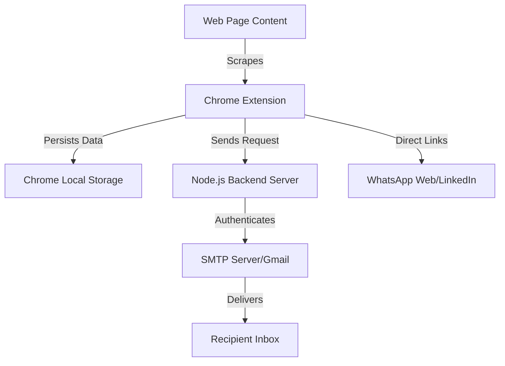

# 🏢 Company Contact Scraper & Outreach System

[](https://developer.chrome.com/docs/extensions/mv3/intro/)
[](https://nodejs.org/)
[](https://nodemailer.com/)

A powerful, professional-grade Chrome extension and backend system designed for B2B lead generation. Automatically scrape emails, LinkedIn profiles, and WhatsApp contacts from any company website and send personalized collaboration emails directly through your own SMTP server.

---

## 🏗️ System Architecture



---

## ✨ Key Features

### 🔍 Intelligent Scraping
- **Automatic Contact Discovery**: Instantly extracts Email addresses, LinkedIn profiles (/in/ and /company/), and WhatsApp contacts from any webpage.
- **Context-Aware Matching**: Uses optimized regex patterns for global and regional (India/USA) contact formats.
- **Deep Link Parsing**: Automatically reads `mailto:`, `wa.me`, and native social links.

### 📧 Professional Outreach
- **Direct SMTP Integration**: Send emails directly from the extension UI using your own Gmail, Outlook, or custom SMTP server.
- **PDF Attachments**: Support for sending collaboration proposals or resumes in PDF format.
- **Template Management**: Saved user details (Name, Email) to streamline repeat outreach.

### 📱 Multi-Channel Communication
- **WhatsApp Integration**: One-click to open WhatsApp Web with pre-formatted numbers.
- **LinkedIn Profiles**: Quick access to decision-maker profiles for direct connection requests.

### 🎨 Premium UI/UX
- **Modern Design**: A clean, dark-themed interface with glassmorphism effects and micro-animations.
- **Real-time Status**: Live feedback on scraping results and email delivery status.

---

## 🚀 Getting Started

### 1. Backend Server Setup (`./backend`)

The backend handles secure email delivery through SMTP.

1.  **Navigate to backend**:
    ```bash
    cd backend
    ```
2.  **Install dependencies**:
    ```bash
    npm install
    ```
3.  **Configure Environment**:
    *   Copy `.env.example` to `.env`: `cp .env.example .env`
    *   Update `.env` with your email credentials (use an **App Password** for Gmail).
4.  **Test SMTP**:
    ```bash
    npm test
    ```
5.  **Start Server**:
    ```bash
    npm start
    ```

### 2. Chrome Extension Setup

1.  Open Chrome and navigate to `chrome://extensions/`.
2.  Enable **Developer mode** in the top-right corner.
3.  Click **Load unpacked** and select the root directory (`extension/`).
4.  **Pin** the "Company Contact Scraper" to your toolbar.

---

## 🛠️ Technology Stack

| Layer | Technologies |
| :--- | :--- |
| **Frontend** | HTML5, Vanilla CSS3, JavaScript (ES6+), Manifest V3 |
| **Backend** | Node.js, Express.js |
| **Email** | Nodemailer, SMTP (Gmail/Outlook/Yahoo) |
| **Storage** | Chrome Storage API (local) |
| **Dev Tools** | PowerShell Scripts, dotenv, Multer (File Uploads) |

---

## 📂 Project Structure

```text
.
├── backend/                # Node.js Email Server
│   ├── server.js           # Main Express server
│   ├── .env                # Secret configuration (local only)
│   ├── GMAIL_SETUP.md      # Detailed Gmail auth guide
│   └── uploads/            # Temporary storage for PDF attachments
├── docs/                   # NEW: Detailed technical documentation
│   ├── FEATURES.md         # Full feature list
│   ├── SETUP_GUIDE.md      # Comprehensive setup instructions
│   ├── TECHNICAL_STACK.md  # Architecture & technologies
│   └── ...                 # Other guides (WhatsApp, LinkedIn, UI)
├── background.js           # Extension service worker
├── content.js              # Web scraping logic
├── popup.html/js/css       # Main Extension User Interface
└── icons/                  # Extension assets
```

---

## 📚 Documentation Index

For deep dives into specific areas, refer to the following guides in the `docs/` folder:

*   **[Setup Guide](docs/SETUP_GUIDE.md)**: Detailed step-by-step installation.
*   **[Technical Stack](docs/TECHNICAL_STACK.md)**: Architecture, patterns, and technologies.
*   **[Feature List](docs/FEATURES.md)**: Exhaustive list of current and planned features.
*   **[WhatsApp Guide](docs/WHATSAPP_GUIDE.md)**: How the WhatsApp integration works.
*   **[LinkedIn Guide](docs/PROFESSIONAL_UI.md)**: UI/UX philosophy and messaging workflow.
*   **[Troubleshooting](docs/WHATSAPP_TROUBLESHOOTING.md)**: Common issues and fixes.

---

## 🛡️ Security & Privacy

*   **Zero-Tracking**: All scraping happens locally in your browser. No data is sent to external servers except your designated backend for emails.
*   **Secure Config**: Sensitive credentials are stored in `.env` and never hardcoded or committed.
*   **App Passwords**: Recommended for Gmail to keep your primary password anonymous.

---

## 🔮 Future Roadmap

*   [ ] **AI Personalization**: Integrate LLMs to generate tailored outreach messages based on website content.
*   [ ] **Contact CRM**: Save and manage scraped leads in a local database.
*   [ ] **Custom Templates**: Create and save multiple email templates for different campaigns.
*   [ ] **Export Options**: Export contacts as CSV or JSON for integration with other tools.

---

Built with ❤️ for professional outreach.
